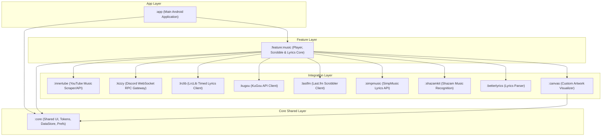

# 🐔 BokBok v2

> **A next-generation social voice chat platform for Android**
> Connect with friends through real-time voice rooms, private chats, and seamless social interactions.

<div align="center">

[](https://kotlinlang.org)
[](https://developer.android.com/jetpack/compose)
[](https://m3.material.io/)
[](https://firebase.google.com/)
[-blue.svg)](LICENSE)

> **📋 Licensing Notice:** BokBok v2 is dual-licensed. Free for personal/non-commercial use, commercial license required for business use. [See licensing details](#-license)

</div>

---

## 📱 What is BokBok?

BokBok is a modern social voice chat application that brings people together through **voice rooms** - virtual spaces where friends can hang out, chat, and connect in real-time. Think of it as your personal lounge where you can:

- 🎙️ **Join voice rooms** with friends or the public
- 💬 **Chat in real-time** with hybrid text messaging
- 👥 **See who's online** and available to talk
- 🎨 **Customize your experience** with themes and profiles
- 🔐 **Create private or public rooms** with flexible controls

### Why BokBok?

Unlike traditional social apps, BokBok focuses on **effortless voice communication** without the pressure of video calls. It's perfect for:

- **Casual hangouts**
- **Study groups**
- **Gaming sessions**
- **Remote teams**
- **Just vibing**

---

## ✨ Key Features

*   **🎙️ Social Voice Rooms**: Low-latency, high-fidelity voice channels powered by WebRTC with customizable privacy, real-time presence indicators, and seamless participant moderation.
*   **🎵 Integrated ArchiveTune Music Engine**: A custom, premium music streaming visualizer and player built directly into the social ecosystem:
    *   **YouTube Music Integration**: Search the vast YouTube catalog, create playlists, continue queues seamlessly, and fetch related recommendation tracks utilizing the modular `:innertube` client.
    *   **Dynamic Audio Quality Control**: Toggle low-latency audio stream profiles dynamically, switching between high-fidelity music mode (A2DP) and low-latency call mode (SCO) for real-time room sharing.
    *   **Synced Lyrics Engine**: Enjoy beautifully synchronized scrolling lyrics aggregated in real-time from multiple providers: LrcLib (`:lrclib`), KuGou (`:kugou`), SimpMusic (`:simpmusic`), and YouTube subtitle captions. Styled with dynamic glassmorphism aesthetics.
    *   **Discord Rich Presence (RPC)**: Dynamically broadcast what you are playing/listening to on Discord using our standalone, high-performance native WebSocket client (`:kizzy`).
    *   **Last.fm scrobbling**: Log played tracks automatically to your profile using the native scrobbling integrations (`:lastfm`).
    *   **Local Device Scanner**: Automatically scan, parse, and synchronize offline device storage music files using MediaStore observers (`LocalMusicSyncManager.kt`) and directory synchronization services.
*   **💬 Real-Time Messenger**: Fully integrated hybrid text chats, group messaging, and private threads with offline local persistence supported by Room.
*   **🤖 Groq AI Companion**: Integrated AI companionship powered by Groq API (`GROQ_API_KEY`) to chat, keep company, and help out directly inside your voice lounges.
*   **🎨 Premium UI/UX Aesthetics**: Beautiful visuals using Jetpack Compose and Material Design 3, dynamic visualizers (`:canvas`), premium layout elements (e.g. dynamic mesh gradient backgrounds), and shimmer loading skeletons.

---

## 🚀 Getting Started

For detailed instructions on how to set up and run the project, please see the [**Setup Guide**](SETUP.md).

---

## 🏗️ Technical Architecture & Modular Design

BokBok is built using a modern, scalable, and highly decoupled multi-module architecture. This makes features reusable, testable, and compile times incredibly fast.

### Module Topology Map


### Stack & Architecture
```
Jetpack Compose          → Premium declarative UI framework
Kotlin Coroutines        → High-concurrency background operations
Firebase Firestore       → Real-time document persistence
Firebase Realtime DB     → User presence tracking & signaling
Firebase Auth            → Secure User Authentication
Room Database            → Local sqlite persistence & message queue
WebRTC                   → Low-latency P2P room communication
Coil                     → Premium image loading and caching
Material Design 3        → Expressive layout themes & tokens
Navigation Compose       → Highly responsive screen routing
ViewModel + StateFlow    → Unidirectional Data Flow state management
Oboe                     → Low-latency native audio engine
```

---

## 🐛 Known Issues & Limitations

- **Room Capacity**: Maximum 50 participants per room.
- **Audio Quality**: Toggleable between 32kbps and 64kbps.
- **Offline Mode**: Limited functionality when disconnected.

---

## 🗺️ Roadmap

### v2.1 (Performance Release) 🔥
- [x] Optimize app launch time (Critical)
- [x] Fix UI recomposition issues
- [ ] Add comprehensive error handling

### v2.2 (Features)
- [ ] In-chat image sharing
- [ ] Voice message recording
- [ ] Room templates for quick setup

---

## 🤝 Contributing

Contributions are welcome! Please read our [**Contributing Guidelines**](CONTRIBUTING.md) to get started.

---

## 📄 License

BokBok v2 is available under a **Dual License**. See the [LICENSE](LICENSE) file for complete terms and conditions.

---

## 📞 Support

- 🐛 **Bug Reports** - [Open an Issue](https://github.com/mustakim-init/bokbok-v2/issues)
- 💬 **Discussions** - [GitHub Discussions](https://github.com/mustakim-init/bokbok-v2/discussions)
- 📧 **Email** - mioact2smart@gmail.com

---

<div align="center">

**Made with ❤️ and ☕ by Mustakim**

[⬆ Back to Top](#-bokbok-v2)

</div>
